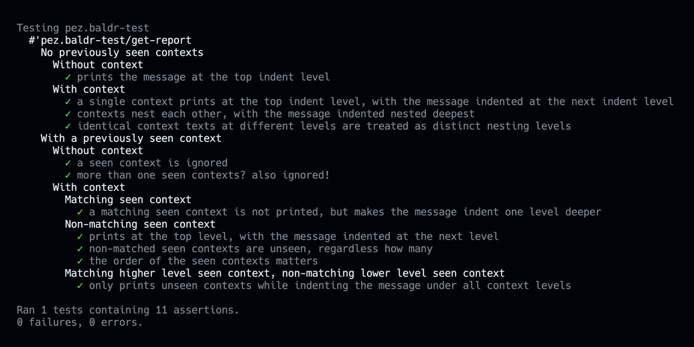
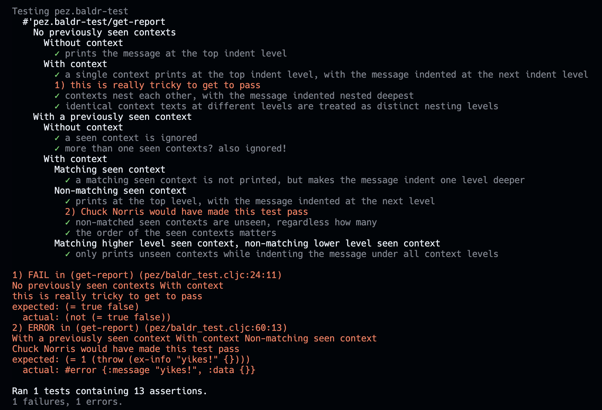

# Baldr, the positive test reporter

You are running all those tests, and they all pass, but you lack the jolt of happiness you get from seeing green checkmarks from each passing test.

[](https://babashka.org)

[clojure.test](https://clojuredocs.org/clojure.test) only brings you the bad news by default. However, `clojure.test/report` is extensible, and Baldr extends it to add positive reporting, [Mocha](https://mochajs.org/) inspired.



Also like Mocha, Baldr collects the reports for the failing and erroring tests, reporting them last, just before the summary. And it also marks the test's assertion message in red, and indexes it in the collection of failure reports.



That's it. Baldr is just a positive test reporter, nothing more. Rather untested out there too, so far. A scrappy fiddle, if you like.

## Usage

Baldr works for [Clojure](https://clojure.org/) and [ClojureScript](https://clojurescript.org/), [Babashka](https://github.com/babashka/babashka) and [nbb](https://github.com/babashka/nbb).

Add it to your project dependencies:

```clojure
io.github.pez/baldr {:mvn/version "1.0.9"}
```

Baldr is only a few multimethods, implementing dispatchers for `clojure.test/report`. As long as `pez.baldr` is required when your tests are run, your tests will be reported with the smile of Baldr.

This is how Baldr is used to report it's own tests in CI:

```yaml
      - name: Test with Clojure
        run: clojure -M -e "(require 'clojure.test 'pez.baldr-test) (clojure.test/run-tests 'pez.baldr-test)"

      - name: Test with ClojureScript
        run: clojure -M:cljs -m cljs.main -re node -i test/pez/baldr_test.cljc  -e "(cljs.test/run-tests 'pez.baldr-test)"

      - name: Test with Babashka
        run: bb -cp src:test -e "(require 'clojure.test 'pez.baldr-test) (clojure.test/run-tests 'pez.baldr-test)"

      - name: Test with nbb
        run: npx nbb -cp src:test -e "(require 'clojure.test 'pez.baldr-test) (cljs.test/run-tests 'pez.baldr-test)"
```

What we do in the [Replicant TodoMVC](https://github.com/anteoas/replicant-todomvc) example is to add a `test/pez/baldr_dummy_test.cljc` file like so:

```clojure
;; Dummy file to make the test runner use Baldr test reporting
(ns pez.baldr-dummy-test
  (:require pez.baldr))
```

## Projects using Baldr

- [Baldr](https://github.com/PEZ/baldr) 😄
- [The Replicant TodoMVC](https://github.com/anteoas/replicant-todomvc)
- [VS-ET: The VS Code Extension Template](https://github.com/PEZ/vscode-extension-template)
- Your project here?

## Hacking on Baldr

Especially with Clojure, you'll need to be a bit wary with multimethods. I find that I often end up making the test runner blow its stack. But someone with more skills probably knows how to properly reload multimethod definitions.

With ClojureScript this happens less frequently and I find that I can more or less work as I am used to from my regular code (where I tend to never use multimethods, hence my lacking interactive programming skills with them).

### Node.js

If you have Node.js installed, an easy way is to run [shadow-cljs](https://shadow-cljs.github.io/docs/UsersGuide.html) in watch mode:

```sh
npm install
npx shadow-cljs watch test
```

And then hack on the Baldr code and tests with your favorite editor.

### Calva

[Calva](https://calva.io/) supports connecting to Baldr's Clojure REPL or both to its Clojure and ClojureScript REPLs

#### Clojure

From VS Code (with Calva installed):

1. Jack in to the `deps.edn` project type
   1. Select the `:dev` alias

Hack on Baldr. The note about multimethod reloading from above applies.

Calva's test runner will not use Baldr's test reporting, unfortunately. But you can evaluate `(get-report)` in the `pez.baldr-test` namespace and then the reporting will be positive.

#### Clojure and ClojureScript

There's no [Figwheel](https://github.com/bhauman/figwheel-main) config yet, so we will use shadow-cljs. For Shadow's REPL to work you will need to have the npm dependencies installed:

```sh
npm install
```

Then, In VS Code (with Calva installed):

1. Jack in, selecting the **shadow-cljs** project type
   1. Select the to start the `:test` build
   1. Wait a second or two
   1. Select to connect the `node-repl` “build” <- **NB: This is not the `:test` build**

Now shadow-cljs is watching your changes and running the tests, using the `:test` build. While Calva is connected to the `node-repl` “build”, which is a built-in shadow-cljs app that lets you stay connected with your editor to change and evaluate your code. This means that saving a file will reload and evaluate a new Baldr in the `:test` build, but it will do nothing for the `node-repl` session that you and VS Code are connected to. There you evaluate and run things as if you didn't have a hot-reloading watcher. (Clojure devs will recognize this mode of development. 😄)

To work with the Clojure version of Baldr, toggle Calva's REPL connection to the `clj` session.

## License

MIT [LICENSE](LICENSE.md)

## Happy and positive testing! ❤️

Please consider supporting my open source work. My family is much happier sharing me with the Clojure comminity when they see that people and companies appreciate me spending time to serve there: [My GitHub Sponsors profile](https://github.com/sponsors/PEZ)